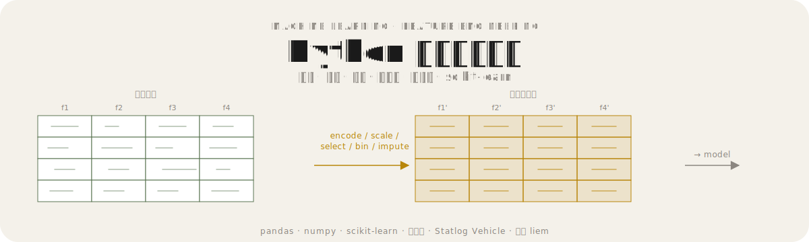
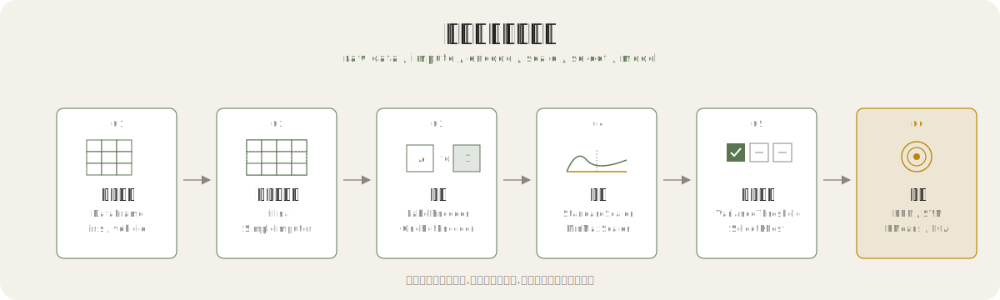
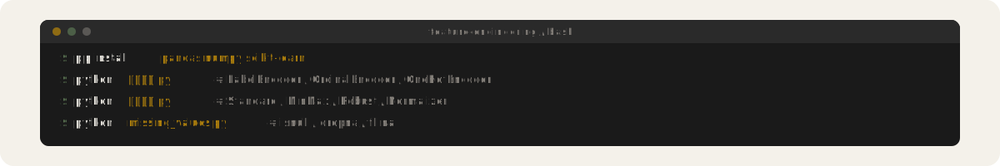
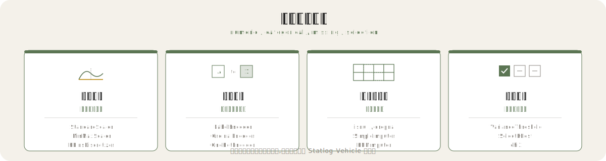
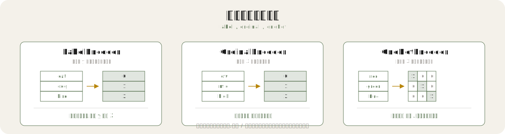
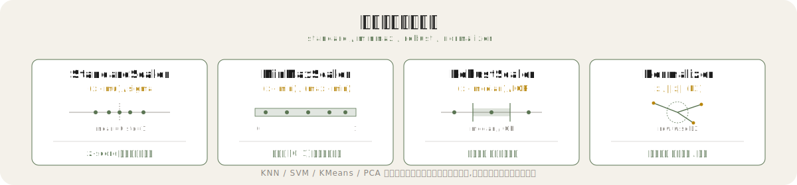

<p align="center">
  
</p>

## 这是什么

一套以 `scikit-learn` + `pandas` 为核心的 Python 特征工程练习脚本,围绕鸢尾花与 Statlog Vehicle 两个经典数据集,把"特征列"从原始形态变换为模型可用的形态。

## 变换长什么样

`StandardScaler` 缩放前的鸢尾花前 3 行:

```text
   sepal_length  sepal_width  petal_length  petal_width
0           5.1          3.5           1.4          0.2
1           4.9          3.0           1.4          0.2
2           4.7          3.2           1.3          0.2
```

`StandardScaler` 缩放后:

```text
   sepal_length  sepal_width  petal_length  petal_width
0      0.020667     0.410371     -0.501527     -0.655709
1     -0.279337    -0.099634     -0.501527     -0.655709
2     -0.579339     0.169258     -0.716724     -0.655709
```

不同量纲被拉到同一尺度,均值归零、方差归一,后续距离类与梯度类算法表现更稳。

<p align="center">
  
</p>

## 为什么不一样

五个主题覆盖特征工程主流水线,每个脚本只做一件事,数据集小而真实,可直接看到变换前后对比:

- **编码** - 把类别标签变成数字:`LabelEncoder`(目标列)、`OrdinalEncoder`(特征列序号)、`OneHotEncoder`(独热哑变量)
- **缩放** - 把不同量纲的特征拉到同一尺度:`StandardScaler`(z-score)、`MinMaxScaler`([0,1])、`MaxAbsScaler`([-1,1])、`RobustScaler`(中位数 / IQR)、`Normalizer`(行归一)
- **选择** - 砍掉冗余与低信息特征:`VarianceThreshold`(方差阈值)、`SelectKBest` + `chi2`(卡方检验)
- **离散化** - 把连续值切成桶:`KBinsDiscretizer` 三种策略 uniform / quantile / kmeans
- **缺失值** - 检测、删除、填充、插补:`isnull` / `dropna` / `fillna` / `SimpleImputer` / `KNNImputer`

<p align="center">
  
</p>

## 如何使用

<p align="center">
  
</p>

安装依赖:

```bash
pip install pandas numpy scikit-learn
```

按主题运行任一脚本:

```bash
python 特征编码.py
python 特征缩放.py
python 特征选择.py
python 特征离散化.py
python missing_values.py
python sklearn_imputation.py
python exercise.py
```

> Statlog Vehicle 通过 `sklearn.datasets.fetch_openml` 拉取(openml id=18),鸢尾花通过 `load_iris()` 加载,首次运行需联网。

## 文件清单

围绕特征工程主流水线的七个脚本,每个脚本只做一件事,数据集小而真实。

| 文件 | 内容 | 主要 API | 数据集 |
| --- | --- | --- | --- |
| `特征编码.py` | 标签 / 序号 / 独热编码 | `LabelEncoder` / `OrdinalEncoder` / `OneHotEncoder` | Statlog Vehicle (openml id=18) |
| `特征缩放.py` | 标准 / 归一 / 最大绝对值 / 鲁棒 / 行归一 | `StandardScaler` / `MinMaxScaler` / `MaxAbsScaler` / `RobustScaler` / `Normalizer` | 鸢尾花 |
| `特征选择.py` | 方差阈值 + 卡方选择 | `VarianceThreshold` / `SelectKBest` + `chi2` | 鸢尾花 |
| `特征离散化.py` | 等宽 / 等频 / KMeans 分箱 | `KBinsDiscretizer` (uniform / quantile / kmeans) | Statlog Vehicle |
| `missing_values.py` | 缺失值检测 / 删除 / 填充 | `isnull` / `dropna` / `fillna` | 鸢尾花 |
| `sklearn_imputation.py` | sklearn 缺失值插补 | `SimpleImputer` / `KNNImputer` | 鸢尾花 |
| `exercise.py` | 综合练习 | - | - |

## 四类特征变换

<p align="center">
  
</p>

## 编码方法对比

<p align="center">
  
</p>

## 缩放方法对比

<p align="center">
  
</p>

## 原理简述

- **编码**:树模型可接受序号编码,线性 / 距离类模型更偏好独热编码以避免引入伪序。
- **缩放**:KNN、SVM、K-Means、PCA 等基于距离或梯度的算法对量纲敏感,缩放后收敛更快、表现更稳。
- **选择**:方差小意味着信息少;卡方衡量类别特征与目标间的独立性,得分高代表相关性强。
- **离散化**:等宽对异常值敏感,等频能均衡分布,KMeans 按聚类分箱捕获自然聚团。
- **缺失值**:均值 / 中位数 / 众数插补简单稳健;KNN 插补借助近邻样本,适合特征间相关性强的数据。

## 学习建议

1. 先 `特征缩放.py` 与 `特征编码.py`,体感最直观、改动最易看到。
2. 再 `特征选择.py` 与 `特征离散化.py`,理解"信息密度"与"形态转换"。
3. 最后 `missing_values.py` 到 `sklearn_imputation.py`,从 pandas 手动操作过渡到 sklearn 流水线。
4. 用 `exercise.py` 做综合复盘,把五类变换串成一条完整流水线。

## License

<p align="center">
  
</p>

MIT © liem
